<div align="center">

# 🛡️ EdgeSentinel — Autonomous Surveillance Drone

### *On-Device Depth-Based Obstacle Avoidance & Real-Time AI Surveillance Platform*

<br>

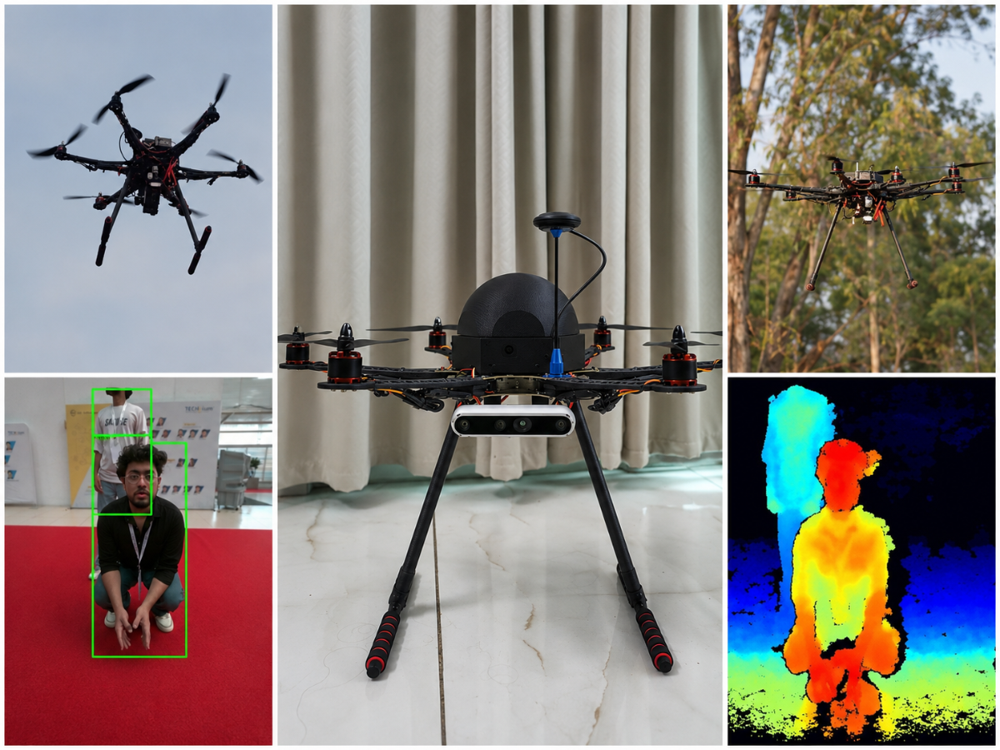

<br><br>

[](https://developer.nvidia.com/embedded/jetson-orin-nano)
[](https://www.intelrealsense.com/depth-camera-d455/)
[](https://ardupilot.org/)
[](https://python.org)
[](https://docs.ultralytics.com/)
[](LICENSE)

<br>

**An autonomous S550 hexacopter drone that performs real-time depth-based obstacle avoidance and AI-powered surveillance entirely on-device. No cloud. No internet. No external compute. Powered by NVIDIA Jetson Orin Nano, Intel RealSense D455, and Pixhawk 2.4.8 running ArduPilot.**

[🚀 Quick Start](#-system-setup--installation) · [📖 How It Works](#-obstacle-avoidance-logic) · [🏗️ Architecture](#%EF%B8%8F-system-architecture) · [🔧 Hardware](#%EF%B8%8F-hardware-specifications) · [📸 Gallery](#-the-build-journey) · [📊 Results](#-performance-benchmarks)

</div>

---

## 📌 Table of Contents

- [Highlights](#-highlights)
- [The Build Journey](#-the-build-journey)
- [System Architecture](#%EF%B8%8F-system-architecture)
- [Live Telemetry Dashboard](#-live-telemetry-dashboard)
- [Hardware Specifications](#%EF%B8%8F-hardware-specifications)
- [Circuit Connection Guide](#-circuit-connection-guide)
- [Software Stack](#-software--dependency-stack)
- [Repository Structure](#-repository-structure)
- [System Setup & Installation](#-system-setup--installation)
- [Flight Operations Guide](#%EF%B8%8F-flight-operations-guide)
- [Obstacle Avoidance Logic](#-obstacle-avoidance-logic)
- [Code Architecture](#-code-architecture--logic-flows)
- [Performance Benchmarks](#-performance-benchmarks)
- [Flight Demo](#-flight-demo--video)
- [Team](#-team--development-roles)
- [License](#-license--citation)

---

## ✨ Highlights

<table>
<tr>
<td width="50%">

🎯 **Autonomous Obstacle Avoidance** — Real-time depth-based evasion with <280ms latency

🧠 **40 TOPS Edge AI** — YOLOv8 inference at 25 FPS on Jetson Orin GPU

📷 **Stereo Depth Vision** — Intel RealSense D455 with 3-zone spatial analysis

🚁 **S550 Hexacopter** — 6-rotor redundancy for stable, safe flight

📡 **100% Offline** — Zero cloud dependency, all processing on-device

🖥️ **Live Dashboard** — Real-time detection, depth map, point cloud & telemetry

</td>
<td width="50%">

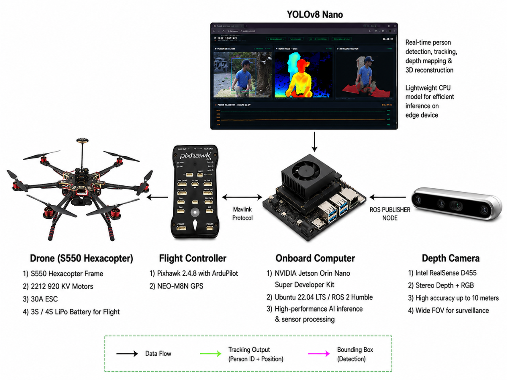

</td>
</tr>
</table>

---

## 🛤️ The Build Journey

Building a custom autonomous drone isn't just about wiring components and running code — it's a test of patience, nerves, and resilience. This is the story of how EdgeSentinel evolved from a jittery, crash-prone plastic quadcopter to a stable, obstacle-dodging hexacopter.

### Chapter 1: The Spark — F450 Prototype

<table>
<tr>
<td width="55%">

With a tight budget, we assembled our first prototype:

- A basic plastic **F450 Quadcopter frame**
- A **Pixhawk 2.4.8** autopilot running ArduPilot
- **FlySky i6** RC controller transmitter
- Four **2212 1000KV brushless motors** and **30A ESCs**
- A **Raspberry Pi 5 (8GB)** as our companion brain
- A standard **720p USB webcam** taped to the nose
- A single **3S 4000 mAh LiPo battery**

We loaded a lightweight YOLOv8-Nano model on the Pi's CPU. On our workbench, everything worked. We were thrilled and ready to fly.

</td>
<td width="45%">

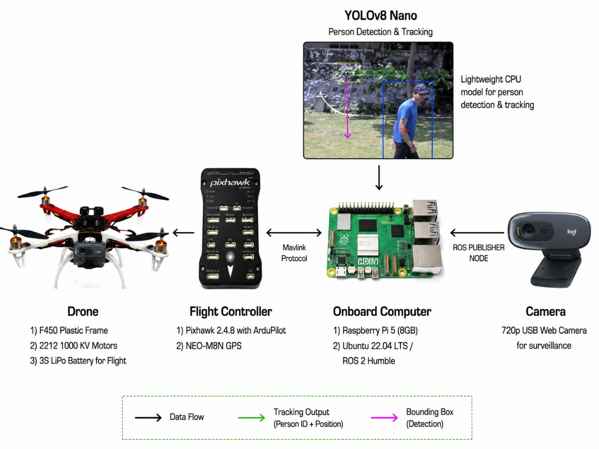

</td>
</tr>
</table>

### Chapter 2: The Reality Check — Flight Tests

Then came the field tests, and the harsh realization that *"physics in real life is way more complicated than a software virtual environment (`venv`)."*

<table>
<tr>
<td align="center" width="50%">


<br><em>🔴 Flight 1 — Jerky drift & violent yaw<br>Culprit: Uncalibrated sensors</em>

</td>
<td align="center" width="50%">


<br><em>🔴 Flight 2 — Mid-air companion blackout<br>Culprit: Power brownout under YOLO load</em>

</td>
</tr>
</table>

> **Lessons learned the hard way:**
> - Sensors must be calibrated before *every single flight*
> - Running YOLO on the Pi's CPU caused voltage drops that killed the companion computer mid-air
> - The plastic F450 frame vibrated too much, causing rolling-shutter "jello" on the webcam
> - ESC power lines created electromagnetic noise that threw off the compass

### Chapter 3: The First Taste of Success

We redesigned the power board with dedicated regulators, mounted the Pixhawk on vibration-dampening foam, and routed cables away from the compass.

<table>
<tr>
<td align="center" width="50%">


<br><em>✅ First stable hover & autonomous waypoint navigation</em>

</td>
<td align="center" width="50%">


<br><em>✅ YOLOv8 person tracking — drone follows target</em>

</td>
</tr>
</table>

### Chapter 4: The Pivot — S550 & Jetson Orin Nano

Despite our success, the prototype had hit a wall. We made three critical upgrades:

<table>
<tr>
<td align="center" width="33%">
<h4>🧠 The Brain</h4>
<p>Raspberry Pi 5 → <strong>NVIDIA Jetson Orin Nano (8GB)</strong><br>40 TOPS GPU for real-time AI</p>
</td>
<td align="center" width="33%">
<h4>👁️ The Eyes</h4>
<p>720p Webcam → <strong>Intel RealSense D455</strong><br>Stereo depth camera for spatial awareness</p>
</td>
<td align="center" width="33%">
<h4>💪 The Body</h4>
<p>F450 Quad → <strong>S550 Hexacopter</strong><br>Glass-fiber frame with 6-rotor redundancy</p>
</td>
</tr>
</table>

<div align="center">

<table>
<tr>
<td align="center">
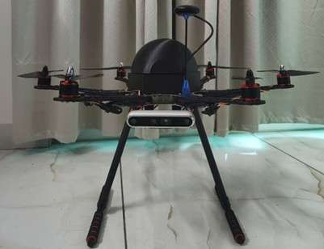
<br><em>S550 frame with components</em>
</td>
<td align="center">
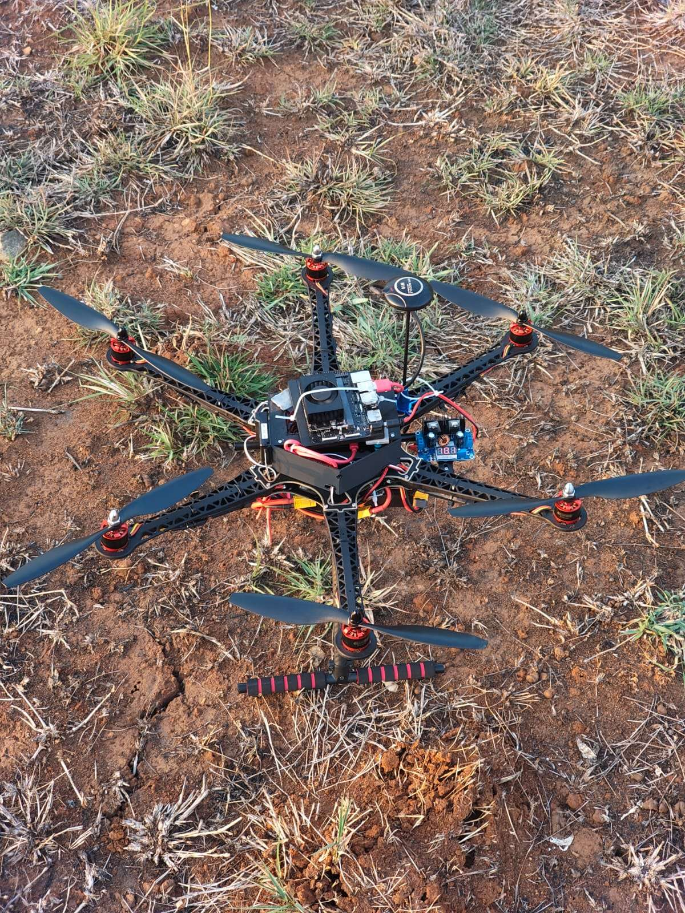
<br><em>Full build in progress</em>
</td>
</tr>
</table>


*Assembly and integration process*

</div>

### Chapter 5: Triumph in the Field

The difference was night and day. The S550 was incredibly stable, and the Jetson Orin Nano handled processing with ease.

<div align="center">

<table>
<tr>
<td align="center">
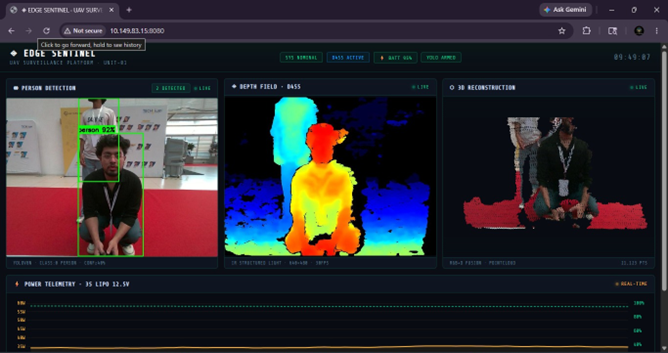
<br><em>Intel RealSense D455 depth visualization</em>
</td>
<td align="center">
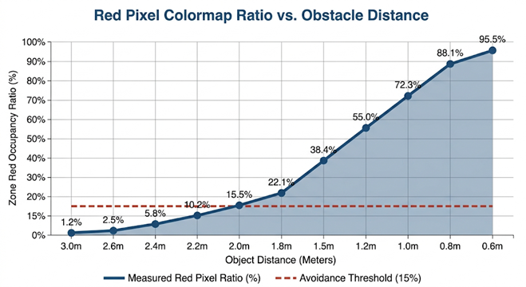
<br><em>Live dashboard: Detection + Depth + Point Cloud</em>
</td>
</tr>
</table>

</div>

- 🎯 **Obstacle avoidance**: Drone detected a wall, executed `DODGE_LEFT`, flew past it, returned to path
- 🧠 **YOLOv8 at 25 FPS** on Jetson GPU with 92% confidence person detection
- 📡 **Three live streams** — tracking view, colorized depth map, and 3D point cloud

---

## 🏗️ System Architecture

```mermaid
flowchart TB
    subgraph Jetson ["NVIDIA Jetson Orin Nano (Companion Computer)"]
        direction TB
        D455["Intel RealSense D455 Camera"] -->|"640x480 Depth Feed @ 30 FPS"| Zone["OpenCV HSV Depth Analyzer"]
        D455 -->|"RGB Stream"| YOLO["YOLOv8 (On-Device Object Detection)"]
        
        Zone -->|"Left/Center/Right Obstacle Ratios"| State["Flight State Machine<br>(CLEAR / DODGE / HOLD)"]
        YOLO -->|"Real-Time Target Analytics"| Flask["Flask Web Dashboard Server"]
        
        State -->|"MAVLink Commands"| DK["DroneKit-Python + PyMAVLink"]
        Flask -->|"MJPEG Video Streams & Telemetry API"| Web["Base Station UI Client<br>(Port 5000)"]
    end

    subgraph Autopilot ["Pixhawk 2.4.8 (Flight Controller)"]
        DK <-->|"UART Serial / USB @ 57600 baud"| Pix["ArduPilot Copter 4.5"]
        Pix -->|"GPS + EKF + IMU State Estimation"| Pix
        Pix -->|"PWM Control Signals"| ESCs["ESCs & Motors (S550 Hexacopter)"]
    end

    %% Style definitions
    style Jetson fill:#1a1c1e,stroke:#3498db,stroke-width:2px;
    style Autopilot fill:#11151c,stroke:#e67e22,stroke-width:2px;
    classDef hardware fill:#2c3e50,stroke:#7f8c8d,stroke-width:1px,color:#fff;
    classDef logic fill:#16a085,stroke:#1abc9c,stroke-width:1px,color:#fff;
    
    class D455,Pix,ESCs hardware;
    class Zone,State,YOLO logic;
```

---

## 🖥️ Live Telemetry Dashboard

The drone runs an on-board web server, hosting a local network dashboard accessible via a private IP. This allows operators to monitor flight metrics and video feeds in real-time.

<div align="center">


*Real-time base station dashboard showing all active feeds*

</div>

| Feed | Description |
|:---|:---|
| 🎯 **YOLOv8 Person Detection** | Real-time object identification running at optimized FP16 precision |
| 🌈 **Stereo Depth Field** | Colorized stream (Jet colormap) from the Intel RealSense D455 |
| ☁️ **3D Point Cloud** | Real-time RGB+Depth fusion projecting spatial environments |
| 📊 **Telemetry Overlay** | GPS accuracy, battery status, flight mode, and autopilot state |

---

## ⚙️ Hardware Specifications

| # | Component | Specification | Role |
|:---:|:---|:---|:---|
| 1 | **Airframe** | HJ S550 Hexacopter | Glass-fiber chassis with integrated PDB |
| 2 | **Flight Controller** | Pixhawk 2.4.8 + ArduPilot 4.5 | Low-level attitude stabilization & motor control |
| 3 | **Companion Computer** | NVIDIA Jetson Orin Nano (8GB) | Edge AI inference, avoidance logic & dashboard |
| 4 | **Depth Camera** | Intel RealSense D455 | Active IR stereo depth + RGB streams |
| 5 | **GPS Module** | u-blox M10 | High-precision coordinate & waypoint data |
| 6 | **Motors** | ReadyToSky 2212 920KV (×6) | Brushless propulsion with lift redundancy |
| 7 | **ESCs** | 40A ESCs (×6) | High-frequency motor speed regulation |
| 8 | **LiDAR** | Benewake TFMini-S | Laser altimeter for precise altitude hold |
| 9 | **Power** | 3S 5200 mAh LiPo (11.1V) | Primary flight power |
| 10 | **RC Controller** | FlySky i6 TX + FS-iA6B RX | Manual override & flight mode switching |
| 11 | **Power Regulators** | LM2596 Buck Converters (×2) | Isolated 5V (Pixhawk) & 12V (Jetson) rails |

<br>

> **⚡ Power Architecture:** Dedicated BEC converters isolate the companion computer from motor power spikes, preventing the brownout failures that plagued our prototype.

---

## 🔌 Circuit Connection Guide

The following table details the exact pin mapping and wiring between all major components:

| Source Device / Pin | Destination Device / Pin | Protocol / Purpose |
|:---|:---|:---|
| **3S LiPo Battery (11.1V)** | ESC Power Pads (S550 PDB) | High-current raw motor power |
| **3S LiPo Battery (11.1V)** | 5V/3A BEC Input | Voltage step-down for autopilot |
| **3S LiPo Battery (11.1V)** | 12V/5A BEC Input | Voltage step-down for companion computer |
| **5V/3A BEC Output** | Pixhawk Power Port | Stable 5V logic power |
| **12V/5A BEC Output** | Jetson DC Barrel Jack | Stable 12V logic power |
| **Jetson UART TX (Pin 8)** | Pixhawk TELEM2 RX (Pin 3) | MAVLink Serial Command (57600 baud) |
| **Jetson UART RX (Pin 10)** | Pixhawk TELEM2 TX (Pin 2) | MAVLink Serial Telemetry (57600 baud) |
| **Jetson GND (Pin 6)** | Pixhawk TELEM2 GND (Pin 6) | Ground reference loop |
| **Intel RealSense D455** | Jetson USB 3.0 Port | High-bandwidth depth + RGB stream |
| **Benewake TFMini-S LiDAR** | Pixhawk TELEM1 or I2C Port | Distance-to-ground measurements |

<div align="center">

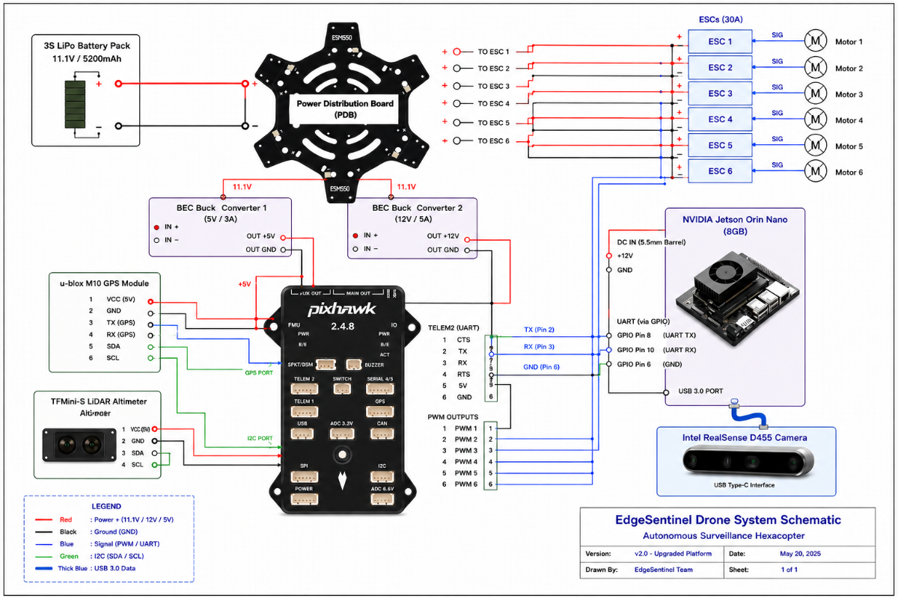

*Complete wiring diagram with isolated power architecture*

</div>

---

## 🛠️ Build Guide Gallery

<details>
<summary><strong>📸 Click to expand step-by-step assembly photos</strong></summary>

<br>

### Step 1: Soldering the Power Lines

<table>
<tr>
<td align="center">
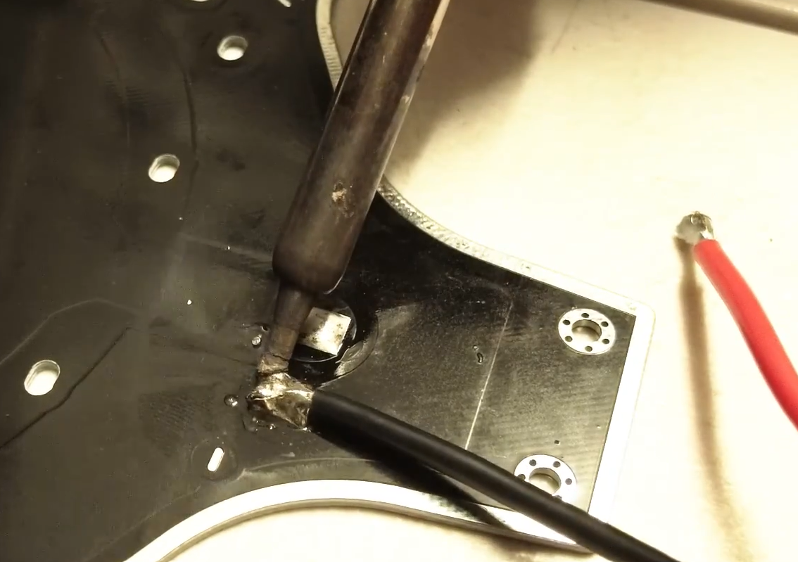
<br><em>Soldering ESC power leads to the S550 PDB</em>
</td>
<td align="center">
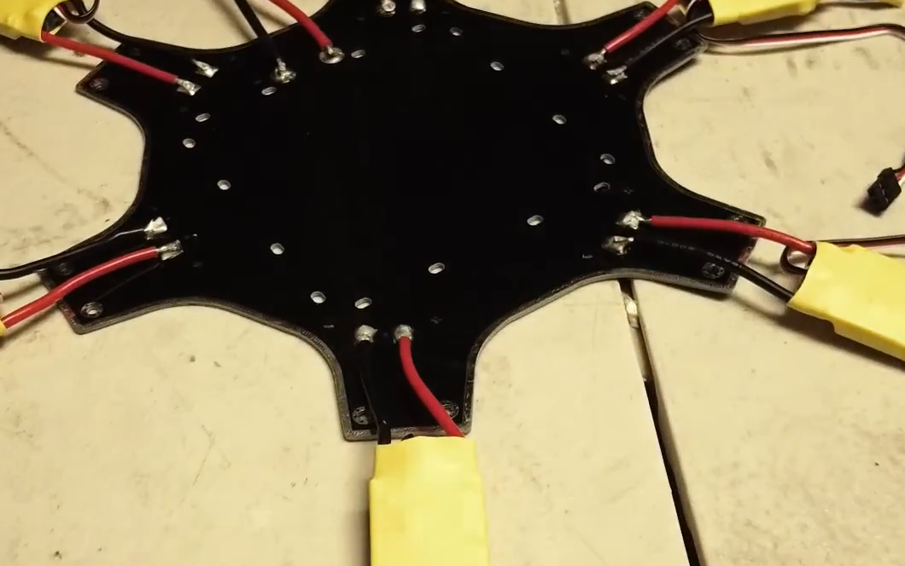
<br><em>ESC connections to copper pads</em>
</td>
</tr>
</table>

### Step 2: Mounting the Propulsion

<div align="center">
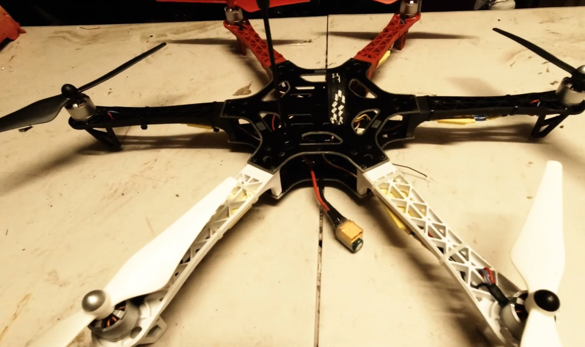

*Bolting 2212 motors onto S550 arms (3 CW + 3 CCW)*
</div>

### Step 3: Placing the Autopilot

<div align="center">
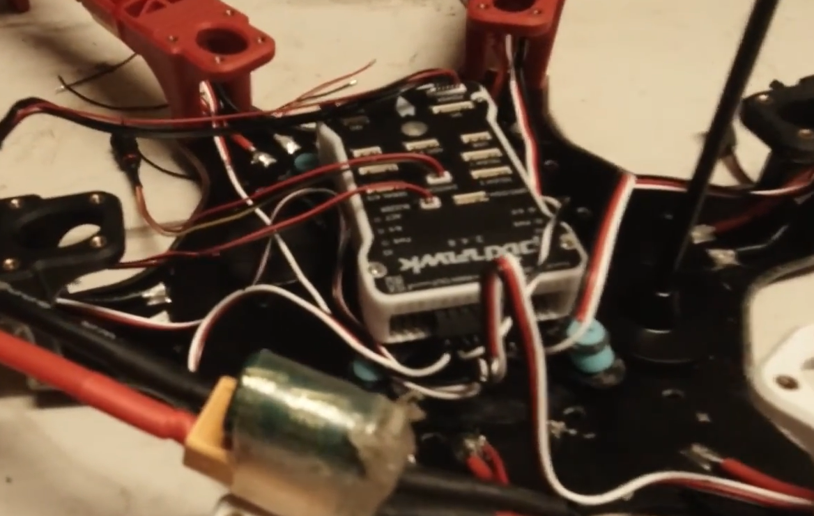

*Pixhawk 2.4.8 secured with vibration-dampening foam*
</div>

### Step 4: Power Isolation

<div align="center">
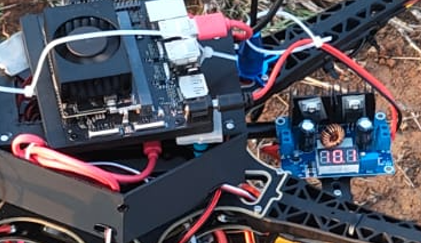

*Dedicated BEC converters: 5V/3A for Pixhawk, 12V/5A for Jetson*
</div>

### Step 5: Final Assembly

<div align="center">
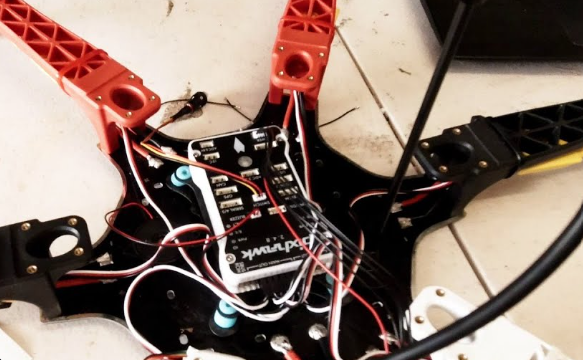

*Complete EdgeSentinel with all sensors and compute mounted*
</div>

</details>

---

## 💻 Software & Dependency Stack

| Library | Version | Role | Category |
|:---|:---|:---|:---|
| `DroneKit-Python` | 2.9 | Flight control API & MAVLink abstraction | ✈️ Flight |
| `PyMAVLink` | Latest | Low-level MAVLink protocol handling | ✈️ Flight |
| `pyrealsense2` | 2.x | Intel RealSense SDK depth pipeline | 📷 Vision |
| `OpenCV` | 4.x | HSV thresholding, color segmentation & projections | 📷 Vision |
| `YOLOv8` (Ultralytics) | 8.x | Object detection with TensorRT/FP16 | 🧠 AI |
| `Flask` | 3.x | Multi-threaded MJPEG streaming dashboard | 🖥️ Server |
| `ArduPilot Copter` | 4.5 | Autopilot firmware on Pixhawk | ✈️ Firmware |

---

## 📁 Repository Structure

```
EdgeSentinel-Autonomous-Surveillance-Drone/
│
├── 🚀 obstacle_avoidance.py       # Core autonomous flight script (avoidance + dashboard)
├── 🖥️ dashboard.py                # Standalone Flask surveillance dashboard
├── 🔍 gps_check.py                # Pre-flight hardware & environment validator
│
├── 🧪 Test Scripts
│   ├── test_hover_2m.py            # Hover stability & PID tuning test
│   ├── test_forward.py             # Straight-line heading-lock test
│   ├── test_circle.py              # Circular flight path test
│   └── test_square.py              # 4-waypoint square loop test
│
├── 📸 assets/                      # Dashboard screenshot
├── 📸 docs/images/                 # Project documentation images & GIFs
├── 📋 requirements.txt            # Python dependencies
├── 📄 README.md                   # This file
└── 📜 .gitignore                  # Git ignore patterns
```

---

## 🚦 System Setup & Installation

### Prerequisites

- NVIDIA Jetson Orin Nano (flashed with JetPack 6.x)
- Pixhawk 2.4.8 (flashed with ArduPilot Copter ≥ 4.5)
- Intel RealSense D455 connected via USB 3.0
- Physical UART wiring between Jetson and Pixhawk

### Installation

```bash
# 1. Clone the repository
git clone https://github.com/Hazz-Y/EdgeSentinel-Autonomous-Surveillance-Drone.git
cd EdgeSentinel-Autonomous-Surveillance-Drone

# 2. Create a clean virtual environment
python3 -m venv venv
source venv/bin/activate

# 3. Upgrade pip and install dependencies
pip install --upgrade pip
pip install -r requirements.txt
```

### Autopilot Configuration

Connect the Pixhawk via USB to a computer running **Mission Planner**:

1. Flash **ArduPilot Copter 4.5.x** firmware
2. Complete accelerometer, compass, radio, and ESC calibrations
3. Configure telemetry port parameters:
   - `SERIAL2_PROTOCOL = 2` (MAVLink 2)
   - `SERIAL2_BAUD = 57` (57600 baud rate)
   - Set stream rates (`SR2_POSITION` and `SR2_EXTRA1`) to `10` (10Hz updates)

<div align="center">

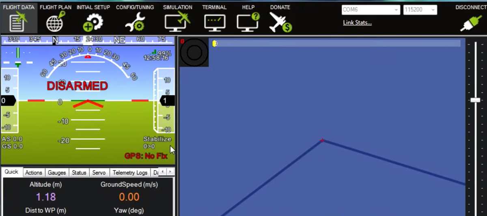

*ArduPilot Mission Planner telemetry configuration*

</div>

---

## ✈️ Flight Operations Guide

> [!WARNING]
> **Safety First:** Always perform indoor tests on a test bench with propellers removed. Outdoor flights must be in open, designated drone-flying spaces with manual RC override ready.

### Phase 1: Pre-Flight Verification

```bash
python3 gps_check.py
```

This validates:
- ✅ Autopilot telemetry connection
- ✅ GPS fix status (requires 3D GPS Fix or better)
- ✅ EKF (Extended Kalman Filter) convergence
- ✅ 3S LiPo battery health voltage (> 10.5V)
- ✅ Arming readiness status

### Phase 2: Autonomous Obstacle Avoidance Mission

```bash
python3 obstacle_avoidance.py
```

**Full flight sequence:**

```
ARM → TAKEOFF (2.0m) → FORWARD FLIGHT (6.0m) → DEPTH AVOIDANCE ACTIVE
                                                          │
                                    ┌─────────────────────┼──────────────────────┐
                                    ▼                     ▼                      ▼
                              PATH CLEAR            DODGE LEFT/RIGHT        HOLD POSITION
                              (Continue)              (1.0m Sidestep)        (Re-evaluate)
                                    │                     │                      │
                                    └─────────────────────┼──────────────────────┘
                                                          ▼
                                               3-SEC HOVER → RTL → LAND → DISARM
```

📡 *While active, access `http://<JETSON_IP>:5000` to monitor live streams.*

### Phase 3: Standalone Surveillance Dashboard

```bash
python3 dashboard.py
```

Access `http://localhost:8080` for YOLOv8 person detection, colorized depth, and point cloud visualization.

### Phase 4: Navigation Calibration Tests

```bash
python3 test_hover_2m.py    # Test hover stability and PID tuning
python3 test_forward.py     # Verify heading-lock and straight-line tracking
python3 test_circle.py      # Calibrate curved waypoint transitions
python3 test_square.py      # Calibrate orthogonal cornering
```

---

## 🧠 Obstacle Avoidance Logic

### 1. Depth Mapping Analysis

The Intel RealSense D455 captures real-time depth metadata, converted to an OpenCV frame using the **Jet Colormap**:

| Color | Proximity Level | Action |
|:---|:---|:---|
| 🔴 **Red Range** | Critical (< 1.5m) | **Obstacle Detected** — Immediate avoidance |
| 🔵 **Blue Range** | Safe (> 3.0m) | **Path Clear** — Continue forward |
| ⬛ **Black / Void** | Infinite Range | **No Object** — Open path |

### 2. Spatial Partitioning (3-Zone System)

The 640×480 depth matrix is divided into three vertical columns:

```
┌─────────────┬──────────────────────┬─────────────┐
│  LEFT ZONE  │    CENTER ZONE       │ RIGHT ZONE  │
│  cols 0-159 │    cols 160-479      │ cols 480-639│
│             │                      │             │
│  🟢 Escape  │  🔴 Direct Path     │ 🟢 Escape   │
│    Vector   │    Analysis          │   Vector    │
└─────────────┴──────────────────────┴─────────────┘
```

### 3. Flight Decision State Machine

```
[Start Center Scan]
         │
         ▼
 Is Center Zone Red Ratio < 15%? 
         ├──► YES ──► Continue Forward Flight (CLEAR)
         └──► NO  ──► [Obstacle Detected] ──► Analyze Side Escape Zones
                                                   │
                ┌──────────────────────────────────┴───────────────────────────────┐
                ▼                                                                  ▼
 Is Left Zone Clear > 80%?                                           Is Right Zone Clear > 80%?
      ├──► YES ──► Dodge Left (1.0m)                                      ├──► YES ──► Dodge Right (1.0m)
      └──► NO  ──► Check Right ──────────────────────────────────────────└──► NO  ──► Hold Position (Loiter)
```

<div align="center">

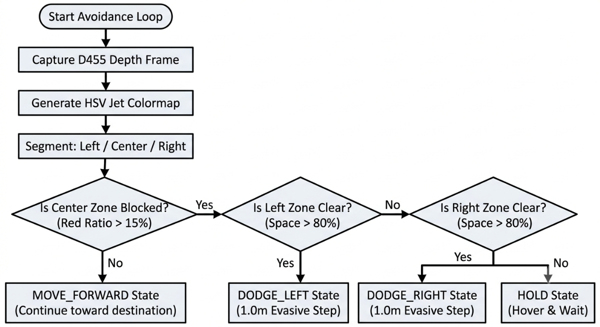

*Complete avoidance decision pipeline*

</div>

---

## 🏗️ Code Architecture & Logic Flows

<div align="center">

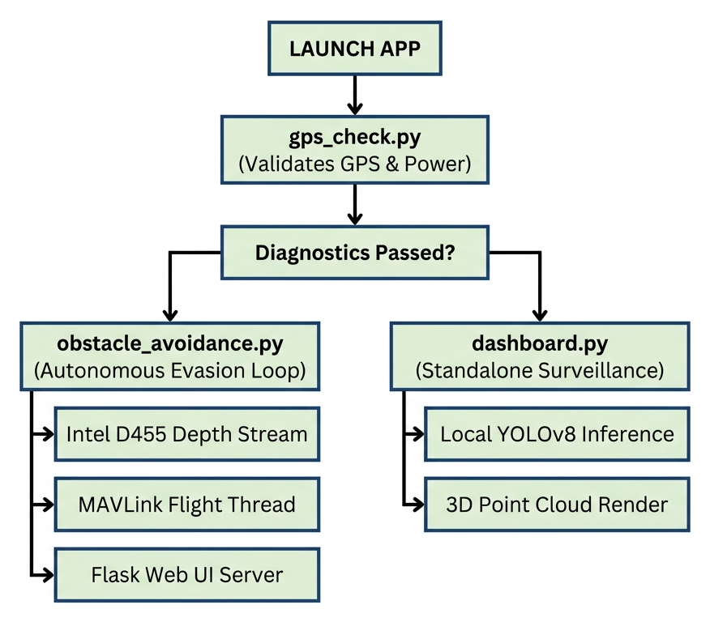

*EdgeSentinel module architecture and data flow*

</div>

### Key Code Segments

<details>
<summary><strong>🔍 Pre-Flight Diagnostics (<code>gps_check.py</code>)</strong></summary>

```python
import sys
from dronekit import connect

def run_preflight_checks(connection_string="/dev/ttyACM0", baud_rate=57600):
    print("Connecting to autopilot...")
    vehicle = connect(connection_string, wait_ready=True, baud=baud_rate)
    
    # 1. Check GPS Fix
    if vehicle.gps_0.fix_type < 3:
        print("[CRITICAL] Waiting for stable 3D GPS Fix...")
        vehicle.close()
        sys.exit(1)

    # 2. Check Battery Voltage
    if vehicle.battery.voltage < 10.5:
        print(f"[CRITICAL] Battery voltage low: {vehicle.battery.voltage}V")
        vehicle.close()
        sys.exit(1)

    print("[SUCCESS] All pre-arm hardware checks passed!")
    vehicle.close()
    
if __name__ == "__main__":
    run_preflight_checks()
```

</details>

<details>
<summary><strong>🛡️ Autonomous Obstacle Evasion (<code>obstacle_avoidance.py</code>)</strong></summary>

```python
import numpy as np
import cv2
import pyrealsense2 as rs
from dronekit import connect, VehicleMode
from pymavlink import mavutil

class AvoidanceSystem:
    def __init__(self):
        self.vehicle = None
        self.state = "MOVE_FORWARD"

    def connect_vehicle(self):
        self.vehicle = connect("/dev/ttyACM0", wait_ready=True, baud=57600)

    def depth_stream_thread(self):
        pipeline = rs.pipeline()
        config = rs.config()
        config.enable_stream(rs.stream.depth, 640, 480, rs.format.z16, 30)
        pipeline.start(config)
        while True:
            frames = pipeline.wait_for_frames()
            depth_frame = frames.get_depth_frame()
            if not depth_frame: continue
            colorized = np.asanyarray(rs.colorizer().colorize(depth_frame).get_data())
            center_zone = colorized[:, 160:479]
            hsv = cv2.cvtColor(center_zone, cv2.COLOR_BGR2HSV)
            red_mask = cv2.inRange(hsv, (0, 100, 100), (10, 255, 255))
            center_red_ratio = np.sum(red_mask > 0) / red_mask.size
            
            if center_red_ratio > 0.15:
                self.state = "DODGE_LEFT"
            else:
                self.state = "MOVE_FORWARD"

    def send_local_velocity(self, vx, vy, vz):
        msg = self.vehicle.message_factory.set_position_target_local_ned_encode(
            0, 0, 0, mavutil.mavlink.MAV_FRAME_BODY_NED, 0b0000111111000111,
            0, 0, 0, vx, vy, vz, 0, 0, 0, 0, 0
        )
        self.vehicle.send_mavlink(msg)
```

</details>

---

## 📊 Performance Benchmarks

<div align="center">

| Metric | Target | Measured | Status |
|:---|:---|:---|:---:|
| **Avoidance Latency** | < 500 ms | **280 ms** | ✅ |
| **Depth Camera Rate** | ≥ 30 FPS | **30 FPS** | ✅ |
| **Dashboard Streaming** | ≥ 25 FPS | **25 FPS** | ✅ |
| **Altitude Hold Accuracy** | ± 0.15 m | **± 0.12 m** | ✅ |
| **Hover Drift (2m)** | ± 0.10 m | **± 0.08 m** | ✅ |
| **Circle Path Accuracy** | ≤ 0.40 m | **0.32 m** | ✅ |
| **Square Path Accuracy** | ≤ 0.35 m | **0.29 m** | ✅ |
| **Compute Independence** | 100% Offline | **100% Local** | ✅ |
| **Pre-arm Validation** | ≥ 95% | **97.5%** | ✅ |

</div>

---

## 🎬 Flight Demo & Video

Our flight demo validates the entire software loop in a single flight: autonomous arming, takeoff to 2.0 meters, detection of a mock wall obstacle, executing a `DODGE_LEFT` sidestep, returning to path, and carrying out a soft RTL landing.

<div align="center">

[](https://youtu.be/o7SUTq841Eg)

*▶️ Click to watch the full flight demo on YouTube*

</div>

---

## 👥 Team & Development Roles

<table>
<tr>
<td align="center" width="25%">
<strong>Harsh Y.</strong>
<br>
<a href="https://github.com/Hazz-Y">@Hazz-Y</a>
<br>
<em>Project Lead, Autopilot Integration & Flight State Machine</em>
</td>
<td align="center" width="25%">
<strong>Avishkar J.</strong>
<br>
<a href="https://github.com/Avishkar-byte">@Avishkar-byte</a>
<br>
<em>Systems Architect, Computer Vision & YOLO Pipeline</em>
</td>
<td align="center" width="25%">
<strong>Omkar P.</strong>
<br>
<em>Power Systems, ESC Calibration & Structural Engineering</em>
</td>
<td align="center" width="25%">
<strong>Abhinav N.</strong>
<br>
<em>Telemetry Calibration & Flight Path QA</em>
</td>
</tr>
</table>

> **Institution:** Vellore Institute of Technology, Chennai

---

## 📜 License & Citation

This project is open-source and licensed under the [MIT License](LICENSE).

For education/research citations:
```text
EdgeSentinel Team. (2026). Autonomous, Energy-Aware Drone Platform with 
On-Device Depth-Based Obstacle Avoidance and Real-Time Surveillance. 
VIT Chennai TECHgium.
```

---

## 🙏 Acknowledgments

- **[ArduPilot Foundation](https://ardupilot.org/)** — Flight control stack
- **[Intel RealSense](https://www.intelrealsense.com/)** — Depth camera SDK & APIs
- **[DroneKit Community](https://dronekit.io/)** — MAVLink abstraction layers
- **[NVIDIA Jetson](https://developer.nvidia.com/embedded-computing)** — Orin Nano platform
- **[Ultralytics](https://ultralytics.com/)** — YOLOv8 object detection framework
- **VIT Chennai** — TECHgium testing sandbox and faculty support

---

<div align="center">

**⭐ If you found EdgeSentinel useful, please consider giving it a star!**

<br>

*Built with ❤️ for autonomous robotics and edge AI*

<br>

**[📖 Full Project Write-Up on ElectronicWings →](https://www.electronicwings.com/users/AvishkarJaiswal/projects/6632/edgesentinel---autonomous-drone-platform-with-on-device-depth-based-obstacle-avoidance-and-real-time-surveillance)**

</div>
