```mermaid
flowchart TB
    subgraph Jetson ["NVIDIA Jetson Orin Nano (Companion Computer)"]
        direction TB
        D455["Intel RealSense D455 Camera"] -->|"640x480 Depth Feed @ 30 FPS"| Zone["OpenCV HSV Depth Analyzer"]
        D455 -->|"RGB Stream"| YOLO["YOLOv8 (On-Device Object Detection)"]
        
        Zone -->|"Left/Center/Right Obstacle Ratios"| State["Flight State Machine<br>(CLEAR / DODGE / HOLD)"]
        YOLO -->|"Real-Time Target Analytics"| Flask["Flask Web Dashboard Server"]
        
        State -->|"MAVLink Commands"| DK["DroneKit-Python + PyMAVLink"]
        Flask -->|"MJPEG Video Streams & Telemetry API"| Web["Base Station UI Client<br>(Port 5000)"]
    end

    subgraph Autopilot ["Pixhawk 2.4.8 (Flight Controller)"]
        DK <-->|"UART Serial / USB @ 57600 baud"| Pix["ArduPilot Copter 4.5"]
        Pix -->|"GPS + EKF + IMU State Estimation"| Pix
        Pix -->|"PWM Control Signals"| ESCs["ESCs & Motors (S550 Hexacopter)"]
    end

    %% Style definitions
    style Jetson fill:#1a1c1e,stroke:#3498db,stroke-width:2px;
    style Autopilot fill:#11151c,stroke:#e67e22,stroke-width:2px;
    classDef hardware fill:#2c3e50,stroke:#7f8c8d,stroke-width:1px,color:#fff;
    classDef logic fill:#16a085,stroke:#1abc9c,stroke-width:1px,color:#fff;
    
    class D455,Pix,ESCs hardware;
    class Zone,State,YOLO logic;
```

<p align="center">
  
  
  
  
  
</p>

# EdgeSentinel

### **Autonomous, Energy-Aware Drone Platform with On-Device Depth-Based Obstacle Avoidance & Real-Time Surveillance**

> **9th Edition TECHgium® POC Round — VIT Chennai**  
> **PID No:** TG0911360

---

## 📖 Overview

**EdgeSentinel** is a fully autonomous S550 hexacopter designed to perform advanced depth-based obstacle avoidance and real-time human detection/surveillance **entirely on-device**. Operating completely offline without relying on cloud APIs, external compute servers, or internet connectivity, the system processes environment data and executes navigation logic locally.

All sensing, computer vision, deep learning inference, and flight control state machines run on an **NVIDIA Jetson Orin Nano (8GB)**. The companion computer communicates bi-directionally with a **Pixhawk 2.4.8** autopilot running ArduPilot firmware over a high-speed UART connection using the MAVLink protocol.

---

## 🖥️ Live Telemetry Dashboard

The drone runs an on-board web server, hosting a local network dashboard accessible via a private IP. This allows operators to monitor flight metrics and video feeds in real-time.

<p align="center">
  
</p>

* **YOLOv8 Person Detection:** Real-time object identification running at optimized FP16 precision.
* **Stereo Depth Field:** Colorized stream (Jet colormap) from the Intel RealSense D455 depth camera.
* **3D Point Cloud Reconstruction:** Real-time RGB+Depth fusion projecting spatial environments.
* **Telemetry Overlay:** Flight statistics including GPS accuracy, battery status (e.g. 3S LiPo at 12.5V), and autopilot flight mode.

---

## 🛠️ System Architecture

The following diagram illustrates the data flow, computation breakdown, and communication protocols between hardware components.



---

## ⚙️ Hardware Specifications

| Component | Specification | Role / Function |
| :--- | :--- | :--- |
| **Airframe** | HJ S550 Hexacopter | Strong, rigid carbon/glass fiber composite platform |
| **Flight Controller** | Pixhawk 2.4.8 (running ArduPilot Copter 4.5) | Low-level attitude stabilization, sensor integration, and motor control |
| **Companion Computer** | NVIDIA Jetson Orin Nano (8 GB) | High-level perception, obstacle avoidance state machine, AI inference, and server |
| **Primary Sensor** | Intel RealSense D455 (Active IR Stereo Depth) | Captures high-accuracy wide-angle depth fields and RGB images |
| **GPS Module** | u-blox NEO-M8N GPS | Provides global coordinates, 3D lock, and waypoint referencing |
| **Propulsion System** | 2212 920KV Brushless Motors (x6) | Delivers lift and control responsiveness for hexacopter configuration |
| **Electronic Speed Controllers** | 30A SimonK ESCs (x6) | High-frequency motor speed regulation |
| **Power Source** | 3S 5200 mAh LiPo Battery (11.1V - 12.6V) | Power supply for propulsion and onboard electronics |
| **Ground Link** | 433 MHz Radio Telemetry Transceivers | Direct telemetry backup and safety override link |
| **Inter-Board Connection** | Serial UART / Micro-USB (`/dev/ttyACM0` @ 57600) | Secure companion-to-autopilot communication channel |

---

## 💻 Software & Dependency Stack

* **Flight Control API:** `DroneKit-Python` 2.9 + `PyMAVLink` (handles high-level guidance commands)
* **Depth Perception:** Intel `pyrealsense2` (cross-platform Librealsense SDK integration)
* **Computer Vision:** `OpenCV 4.x` (HSV-based thresholding, color segmentation, and Jet colormap projections)
* **Dashboard Server:** `Flask` (supports multi-threaded MJPEG streaming & server-sent telemetry data)
* **AI Object Detection:** `YOLOv8` (optimized using TensorRT/FP16 on the Jetson Orin GPU)
* **Autopilot Firmware:** `ArduPilot Copter 4.5`

---

## 📁 Repository Structure

```text
EdgeSentinel/
├── assets/
│   └── dashboard.jpeg          # Base station dashboard screenshot
├── obstacle_avoidance.py       # Core autonomous flight script (obstacle avoidance & dashboard runtime)
├── dashboard.py                # Standalone Flask surveillance dashboard (person detection & 3D cloud)
├── gps_check.py                # Pre-flight hardware and environment validator
├── test_hover_2m.py            # Test: Arm, takeoff, hold 2m altitude, and log position drift
├── test_circle.py              # Test: Circular pattern flight path execution
├── test_forward.py             # Test: Straight line flight path with compass heading lock
├── test_square.py              # Test: 4-waypoint square loop flight path
├── requirements.txt            # Python dependencies
├── .gitignore                  # Git patterns to ignore
└── README.md                   # Project documentation
```

---

## 🚦 System Setup & Installation

### 1. Prerequisites
* NVIDIA Jetson Orin Nano (flashed with JetPack 6.x)
* Pixhawk 2.4.8 (flashed with ArduPilot Copter $\ge$ 4.5)
* Intel RealSense D455 Camera connected via USB 3.0
* Physical connections wired accordingly:

| Jetson Interface | Pixhawk Interface | Protocol / Settings |
| :--- | :--- | :--- |
| USB Port (`/dev/ttyACM0`) | TELEM2 / Micro-USB | MAVLink v2 @ 57600 baud |
| USB 3.0 Port | - | Native RealSense Video & Depth Pipeline |

### 2. Environment Installation

```bash
# Clone the repository
git clone https://github.com/Hazz-Y/EdgeSentinel-Autonomous-Surveillance-Drone.git
cd EdgeSentinel-Autonomous-Surveillance-Drone

# Create a clean virtual environment
python3 -m venv venv
source venv/bin/activate

# Upgrade package manager and install dependencies
pip install --upgrade pip
pip install -r requirements.txt
```

---

## ✈️ Flight Operations Guide

> [!WARNING]
> **Safety First:** Always perform indoor tests on a test bench with propellers removed, and outdoor flights in open, designated drone-flying spaces with manual RC override ready.

### Phase 1: Pre-Flight Verification
Always run the validation script before launching any mission to verify that crucial hardware modules are online:
```bash
python3 gps_check.py
```
This script validates:
* Autopilot telemetry connection.
* GPS fix status (requires 3D GPS Fix or better).
* EKF (Extended Kalman Filter) convergence.
* 3S LiPo battery health voltage ($> 10.5\text{ V}$).
* Arming readiness status.

### Phase 2: Running Obstacle Avoidance Mission
Launch the main autonomous script:
```bash
python3 obstacle_avoidance.py
```
This handles the full flight sequence:
1. Connects to the Pixhawk and checks safety status.
2. Arms the motors and takes off to a stable altitude of **2.0 meters**.
3. Initiates forward flight of **6.0 meters** while running RealSense depth-avoidance logic.
4. Performs a **3-second hover** at the destination waypoint.
5. Flies backward to the starting position (Return-To-Launch/RTL).
6. Automatically lands and disarms the vehicle.

*While active, access the web UI at `http://<JETSON_IP>:5000` to monitor live streams.*

### Phase 3: Running Standalone Surveillance Dashboard
To run the server without executing flight maneuvers (e.g., for bench testing cameras or monitoring from a static platform):
```bash
python3 dashboard.py
```
Go to `http://localhost:8080` (or the companion computer's LAN IP) to view the YOLOv8 person detection stream, the colorized depth frame, and the point cloud.

### Phase 4: Isolated Navigation Calibrations
```bash
python3 test_hover_2m.py    # Test hover stability and PID tuning
python3 test_forward.py     # Verify heading-lock and straight-line tracking
python3 test_circle.py      # Calibrate curved waypoint transitions
python3 test_square.py      # Calibrate orthogonal cornering and waypoint arrival
```

---

## 🧠 Obstacle Avoidance Logic

### 1. Depth Mapping Analysis
The Intel RealSense D455 captures real-time depth metadata. The raw matrix is converted into an OpenCV frame using the **Jet Colormap** mapping, which represents proximity as follows:

| Color Representation | Proximity Level | Evaluation & Action |
| :--- | :--- | :--- |
| 🔴 **Red Range** | Critical Proximity ($< 1.5\text{m}$) | **Obstacle Detected** — Immediate avoidance action |
| 🔵 **Blue Range** | Safe Range ($> 3.0\text{m}$) | **Path Clear** — Safe to navigate forward |
| ⬛ **Black / Void** | Infinite Range | **No Object** — Open path |

### 2. Spatial Partitioning (3-Zone System)
The $640 \times 480$ depth matrix is divided into three logical vertical columns:

* **Left Zone:** Columns `0` to `159` (Escape/Dodge vector option)
* **Center Zone:** Columns `160` to `479` (Direct flight path vector)
* **Right Zone:** Columns `480` to `639` (Escape/Dodge vector option)

### 3. Flight Decision State Machine
The companion computer makes pathing decisions based on pixel density thresholds:

```
[Start Center Scan]
         │
         ▼
 Is Center Zone Red Ratio < 15%? 
         ├──► YES ──► Continue Forward Flight (CLEAR)
         └──► NO  ──► [Obstacle Detected] ──► Analyze Side Escape Zones
                                                   │
                ┌──────────────────────────────────┴──────────────────────────────────┐
                ▼                                                                     ▼
 Is Left Zone Clear > 80%?                                                 Is Right Zone Clear > 80%?
      ├──► YES ──► Dodge Left (1.0m Sidestep)                                   ├──► YES ──► Dodge Right (1.0m Sidestep)
      └──► NO  ──► Check Right Zone ───────────────────────────────────────────└──► NO  ──► Hold Position (Loiter & Re-evaluate)
```

---

## 📊 Performance Benchmark Outcomes

The system was evaluated against specific guidelines during testing.

| Metric | Target Limit | Measured Results | Evaluation |
| :--- | :--- | :--- | :--- |
| **Avoidance Latency** | $< 500\text{ ms}$ | **$280\text{ ms}$** | ✅ Passed |
| **Depth Camera Rate** | $\ge 30\text{ FPS}$ | **$30\text{ FPS}$** | ✅ Passed |
| **Dashboard Streaming Rate** | $\ge 25\text{ FPS}$ | **$25\text{ FPS}$** | ✅ Passed |
| **Altitude Hold Accuracy** | $\pm 0.15\text{ m}$ | **$\pm 0.12\text{ m}$** | ✅ Passed |
| **Hover Drift Variance (2m)** | $\pm 0.10\text{ m}$ | **$\pm 0.08\text{ m}$** | ✅ Passed |
| **Circle Path Accuracy** | $\le 0.40\text{ m}$ | **$0.32\text{ m}$** | ✅ Passed |
| **Square Path Accuracy** | $\le 0.35\text{ m}$ | **$0.29\text{ m}$** | ✅ Passed |
| **Compute Independence** | $100\%$ Offline | **$100\%$ Local Processing** | ✅ Passed |
| **Pre-arm Validation Rate** | $\ge 95\%$ | **$97.5\%$ (Outdoor GPS)** | ✅ Passed |

---

## 👥 Team & Development Roles

* **Harsh Y. (`Hazz-Y`)** — Project Lead, Autopilot Integration & Flight State Machine
* **Avishkar J. (`Avishkar-byte`)** — Systems Architect, Computer Vision & YOLO Pipeline
* **Omkar P.** — Power Systems, ESC Calibration & Structural Engineering
* **Abhinav N.** — Telemetry Calibration & Flight Path Quality Assurance

---

## 📜 License & Citation

This project is open-source and licensed under the [MIT License](LICENSE). 

For education/research citations, please credit the development team:
```text
EdgeSentinel Team. (2026). Autonomous, Energy-Aware Drone Platform with On-Device Depth-Based Obstacle Avoidance and Real-Time Surveillance. VIT Chennai TECHgium.
```

---

## 🙏 Acknowledgments

* **ArduPilot Foundation** for the flight control stack.
* **Intel RealSense** team for the python binding APIs.
* **DroneKit Developer Community** for the MAVLink abstraction layers.
* **NVIDIA Jetson** developers group for the Orin Nano hardware platform assistance.
* **VIT Chennai** faculty for hosting the Techgium testing sandbox.
